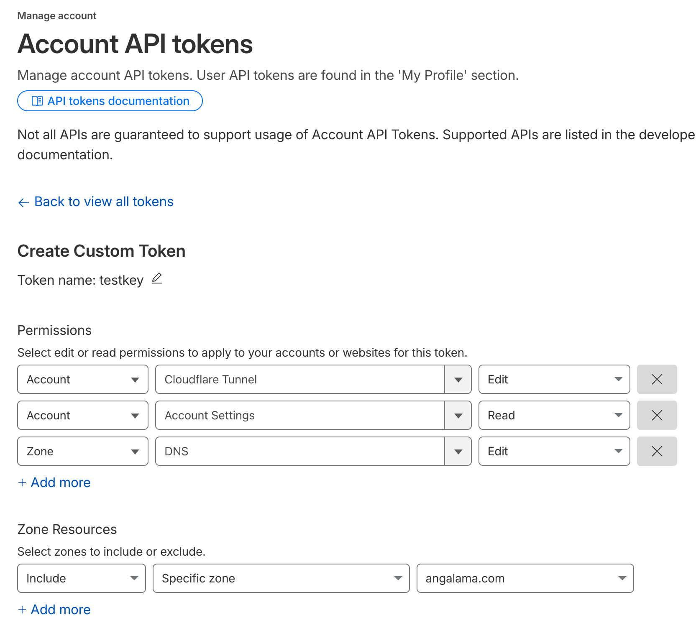

# cfeasy


<!-- WARNING: THIS FILE WAS AUTOGENERATED! DO NOT EDIT! -->

**cfeasy** is a thin wrapper around the official [Cloudflare Python
SDK](https://github.com/cloudflare/cloudflare-python). It lets you
create DNS records and set up Zero Trust tunnels from Python with
minimal boilerplate — ideal for VPS automation and self-hosting.

`verify()` is a safe, read-only check — it lists your zones and tunnels
and confirms the token can reach both. If it returns
`{'result': False}`, your token is missing permissions. Set those up
first.

## API Token Setup

cfeasy needs a **Custom Token** — not a Global API Key. Go to
[dash.cloudflare.com/profile/api-tokens](https://dash.cloudflare.com/profile/api-tokens)
→ **Create Token** → **Custom Token** and add these three permissions:

| Capability | Resource | Permission |
|----|----|----|
| DNS read/write | Zone → DNS | **Edit** *(scope to your zone)* |
| Account info | Account → Account Settings | **Read** |
| Tunnel management | Account → Cloudflare Tunnel | **Edit** |



## DNS Records

`upsert_record` is the main DNS method — it creates a record if it
doesn’t exist, or replaces it if one already exists with the same name
and type. No stale duplicates.

You can use `cfeasy` in any Python environment — a Jupyter notebook, a
script, or an interactive shell. Just import
[`CF`](https://vedicreader.github.io/cfeasy/core.html#cf) and initialize
it with your API token (or set the `CLOUDFLARE_API_TOKEN` environment
variable and skip the argument). just go `from cfeasy import *` and
you’re ready to manage your DNS and tunnels.

``` python
from cfeasy import *
```

``` python
c = CF()  # set CLOUDFLARE_API_TOKEN env var and just do CF() or pass a token directly CF('your-token-here')
# Confirm your token has the right permissions before doing anything
c.verify()  # → {'result': True}
```

    {'result': True}

``` python
# A record pointing "app.angalama.com" at an IP
dom, nm = 'angalama.com', 'app'
c.upsert_record(dom, nm, "1.2.3.4")
```

    {'name': 'app.angalama.com',
     'type': 'A',
     'comment': None,
     'content': '1.2.3.4',
     'proxied': False,
     'settings': {'ipv4_only': None, 'ipv6_only': None},
     'tags': [],
     'ttl': 1,
     'id': '3819309b81252192134793a601f43737',
     'created_on': datetime.datetime(2026, 3, 22, 20, 3, 29, 872980, tzinfo=TzInfo(0)),
     'meta': {},
     'modified_on': datetime.datetime(2026, 3, 22, 20, 3, 29, 872980, tzinfo=TzInfo(0)),
     'proxiable': True,
     'comment_modified_on': None,
     'tags_modified_on': None}

## Tunnels

A [Cloudflare
Tunnel](https://developers.cloudflare.com/cloudflare-one/connections/connect-networks/)
creates an outbound-only connection from your server to Cloudflare’s
edge — no open firewall ports, no public IP needed. Traffic hits
`app.example.com`, Cloudflare routes it through the tunnel to your
`cloudflared` process, which forwards it to your local service.

The three pieces you need: 1. **A tunnel** — a named tunnel registered
with your Cloudflare account 2. **A DNS CNAME** — pointing your
subdomain at `<tunnel-id>.cfargotunnel.com` 3. **A token** — passed to
`cloudflared` so it knows which tunnel to connect to

``` python
# Step 1: create the tunnel
tname = 'my-app'
exists = L.filter(lambda x: x.get('name') == tname)
tid = first(t)['id'] if (t:=exists(c.tunnels())) else c.create_tunnel(tname)['id']
# Step 2: point the subdomain at it (CNAME → <tid>.cfargotunnel.com)
c.tunnel_cname(dom, nm, tid)
# Step 3: get the token for cloudflared
token = c.tunnel_token(tid)
```

## `setup_tunnel` — Everything in One Call

All three steps above collapse into a single method. If a tunnel with
that name already exists, it reuses it rather than creating a duplicate.

| What it does | Result |
|----|----|
| Creates (or reuses) a tunnel named `"app"` | Idempotent — safe to call repeatedly |
| Wires up `app.example.com` as a proxied CNAME | Points at `<tid>.cfargotunnel.com` |
| Returns `(tunnel_id, token)` | Pass `token` as `CF_TUNNEL_TOKEN` to `cloudflared` |

``` python
tid, token = c.setup_tunnel(dom, nm)
# cleanup
c.delete_tunnel(tid)
```
